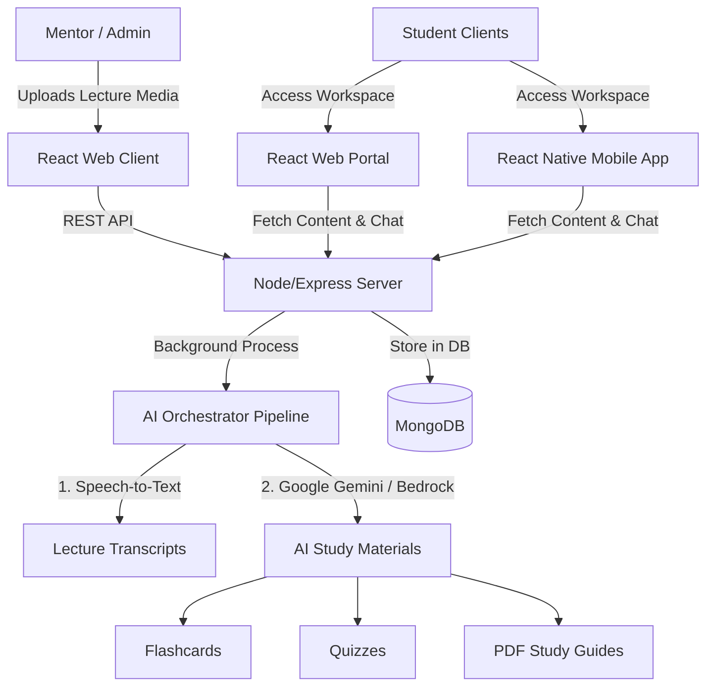

# 🌌 MindForge — The Ultimate AI Study Companion

Welcome to **MindForge**, a premium end-to-end AI educational platform that bridges the gap between classroom lectures and student understanding. 

MindForge empowers mentors to upload lecture media and automatically packages that content into standard-setting, interactive study workspaces (featuring smart transcripts, audio streams, flashcards, dynamic quizzes, PDF guides, and a 24/7 context-grounded AI tutor) accessible on both **Web** and **Mobile** platforms.

---

## 🏛️ Project Architecture
The repository is split into three modular sub-systems:



1. **[server/](file:///c:/Users/krish/OneDrive/Desktop/mindforge2/server)**: Express API backend managing database models, security rules, file storage, audio streaming, and coordinate pipelines with external AI processors.
2. **[client/](file:///c:/Users/krish/OneDrive/Desktop/mindforge2/client)**: React + Vite web portal for mentors to orchestrate courses, analyze student comprehension, and manage files, alongside a rich student web interface.
3. **[mobile/](file:///c:/Users/krish/OneDrive/Desktop/mindforge2/mobile)**: React Native + Expo iOS/Android student client, featuring a unified dark-gold theme, a responsive layout, a custom audio streaming player, flashcard decks, quizzes, and themed popup dialogues.

---

## 🔄 The Detailed Flow of the Project

MindForge is designed around a continuous **Upload $\rightarrow$ Process $\rightarrow$ Study $\rightarrow$ Feedback** loop.

### 1. The Mentor Setup & Upload Flow
* **Course Creation**: A mentor logs into the Web Dashboard, creates a Course, and sets up individual study Sessions.
* **Lecture Ingestion**: The mentor uploads a lecture audio or video file (e.g., `.mp3`, `.mp4`) or a PDF transcript.
* **Automated AI Study Pipeline**: Clicking *"Process Content"* triggers a single, unified backend workflow:
  1. **Transcription**: Raw audio is converted to text using an accurate speech-to-text engine.
  2. **Study Guides**: The transcript is processed to generate structured summary chapters.
  3. **Flashcards**: The AI automatically extracts key vocabulary and definitions into interactive flashcard decks.
  4. **Assessments**: Generates randomized multiple-choice quiz questions based strictly on the lecture text.
  5. **PDF Generation**: Compiles the summaries, key terms, and sample questions into a premium downloadable PDF study booklet.
* **Real-time Notifications**: A notification is sent to the mentor and enrolled students indicating the workspace is active.

### 2. The Student Web & Mobile Workspace Flow
* **Authentication**: Enrolled students log in securely (locked to MindForge’s custom dark-gold theme) on either Web or Mobile.
* **Interactive Player Deck**: Students can stream the lecture audio using a custom audio deck that synchronizes with the lecture chapters.
* **AI Summary Chapters & Flashcards**: Students review structured study guides and test active recall using interactive flipping flashcard screens.
* **Dynamic Quiz Assessment**: Students take the auto-generated quiz. The app provides instant score breakdowns, tracking incorrect answers to highlight areas needing review.
* **24/7 Context-Grounded AI Tutor**: Students chat with a chat assistant. The chatbot uses Retrieval-Augmented Generation (RAG) to ground its answers **strictly in the lecture transcript**, preventing hallucinations and ensuring answers align with what the mentor taught.

### 3. The Feedback & Analytics Loop
* **Student Rating**: After completing a study session, students submit detailed feedback containing:
  - 1-to-5 star ratings.
  - Detailed qualitative text reviews.
* **Mentor Metrics**: The Web Portal compiles this data, drawing live interactive charts. Mentors can see class understanding metrics in real time and see exactly where students need help.

---

## ⚡ Quick Start: Running the Project Locally

To run the full stack, you will need three terminal windows open (one for each workspace).

### 🟢 1. Running the Backend Server
Make sure you have a MongoDB instance running and active API keys in `server/.env`.
```bash
cd server
npm install
npm run dev
```
*The server will boot and listen on port `5000` (e.g. `http://localhost:5000`).*

### 🔵 2. Running the Web Client
```bash
cd client
npm install
npm run dev
```
*Vite will compile and serve the web client on `http://localhost:5173`.*

### 🟡 3. Running the Mobile Application
Ensure your mobile developer server connects to the backend using your active LAN IP address (configured in API services).
```bash
cd mobile
npm install
npm start
```
*Metro Bundler will start. Scan the QR code using the **Expo Go** application on iOS or Android to launch the app instantly with active hot-reloading.*

---

## 🛠️ Key Technologies & Core Dependencies

| Layer | Technologies & Libraries |
| :--- | :--- |
| **Backend** | Node.js, Express, MongoDB (Mongoose), JWT, Axios, Multer |
| **AI Layer** | AWS Bedrock, Google Gemini API, RAG-grounded prompt engineering |
| **Web Frontend** | React 18, Vite, Framer Motion, Vanilla CSS (Premium Gold Theme) |
| **Mobile App** | React Native, Expo (SDK 54), React Navigation, Expo AV (Audio Streams) |

---

## 🔒 Security & Git Management
For enterprise-grade security and developer privacy, all local databases, uploads, `.env` private API credentials, test scratchboards, and DB seed utilities (`server/scratch/`, `server/run-seed.js`, `server/src/utils/seed.js`) are untracked and fully ignored by Git via the master [.gitignore](file:///c:/Users/krish/OneDrive/Desktop/mindforge2/.gitignore) profile.
